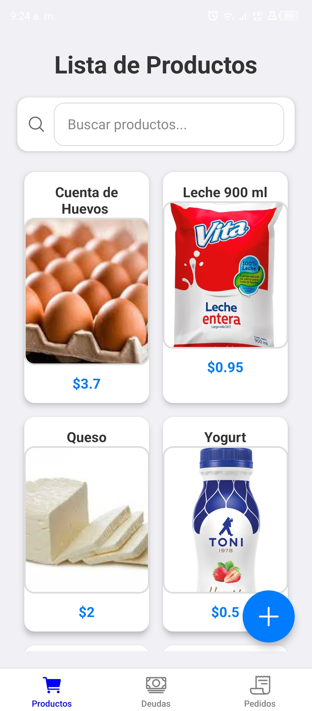
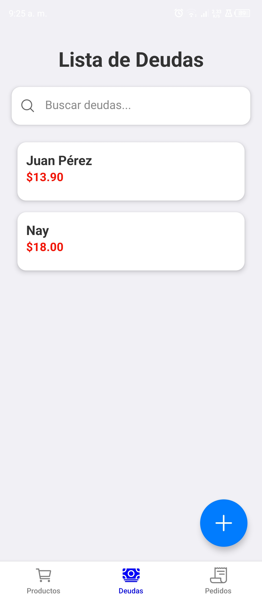
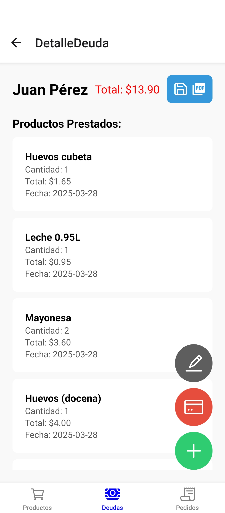
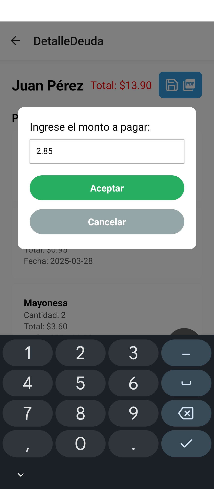
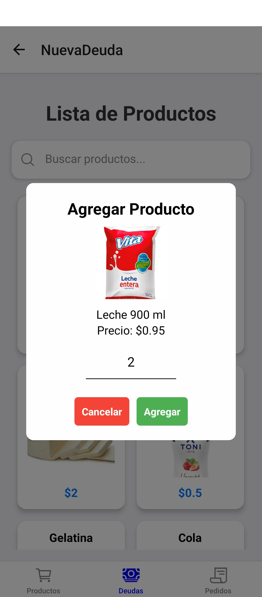
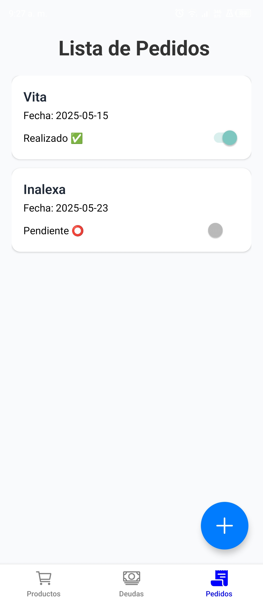
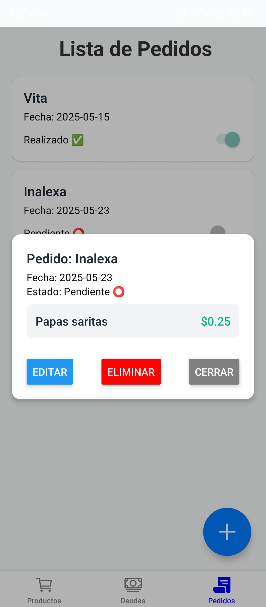
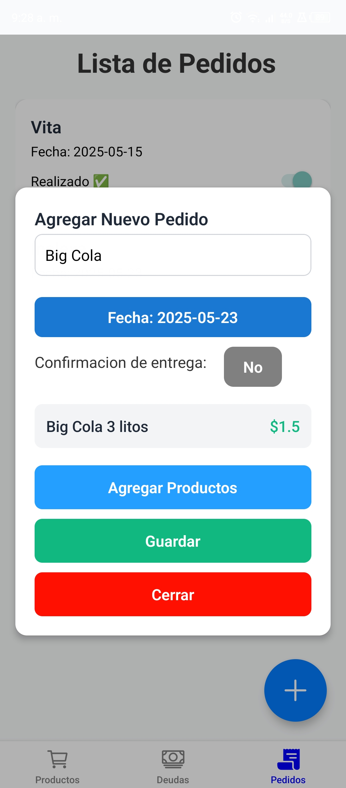

<h1 align="center">📱 Viveres Taty</h1> 
<h3 align="center">Aplicación móvil para la gestión de deudas y pedidos</h3> 
<p align="center"> 
     
     
     
    
</p>
 
---

<h2 align="center">✨ Funcionalidades</h2> 
<ul> 
    <li>🛍️ <strong>Visualización de productos:</strong> Consulta los productos disponibles en la tienda, con imagen, precio y nombre. Puedes modificar su precio e imagen en cualquier momento.</li> 
    <li>📑 <strong>Gestión de deudas:</strong> Organiza las deudas de tus clientes. Puedes editar deudas existentes, agregar más productos, realizar pagos parciales que se actualizan en tiempo real y exportar la lista en PDF para compartirla fácilmente mediante aplicaciones de mensajería.</li> 
    <li>📦 <strong>Gestión de pedidos:</strong> Visualiza una lista detallada de los pedidos realizados a proveedores, con nombre, fecha de entrega y estado (pendiente o entregado). Puedes actualizar el estado del pedido y registrar fechas de entrega para un mejor control.</li> 
</ul>

---

<h2 align="center">⚙️ Tecnologías Utilizadas</h2> 
<p align="center"> 
     
     
     
     
</p>

---

<h2 align="center">🚀 Instalación</h2>

1. Clona el repositorio:
   ```bash
   https://github.com/FrVillaI/Viveres-Taty-.git

2. Instala las dependencias: 
    ```bash
    npm install

3. Configura Firebase:
    - Crea un proyecto en Firebase.
    - Configura una base de datos en tiempo real para almacenar las puntuaciones.

---

<h2 align="center">📸 Capturas de Pantalla</h2> 
    <p align="center"> 
         
         
         
         
         
         
         
        
    </p>

---

<h2 align="center">📬 Contacto</h2> 
<p align="center"> 
    <a href="https://www.linkedin.com/in/isaac-villacis-200609334/" target="_blank"> 
         
    </a> 
    <a href="mailto:isaacrvillacis@gmail.com" target="_blank"> 
         
    </a> 
</p> 
